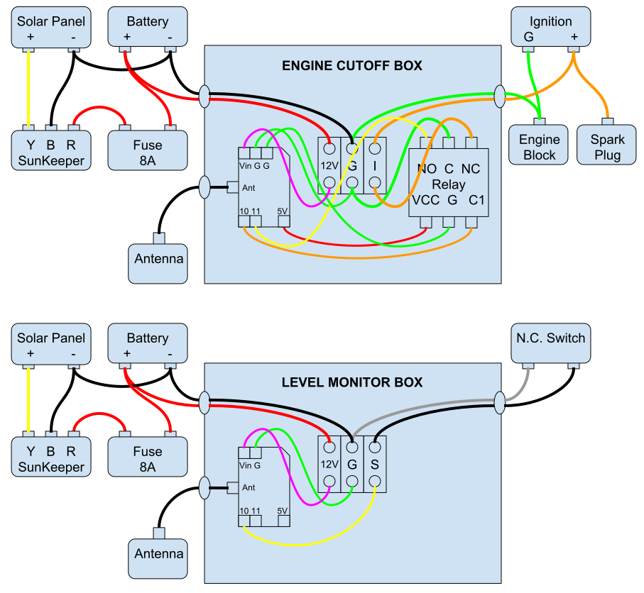

# RemoteBox-KillSwitch

## Overview:
  * Arduino attached to a liquid level height switch.
  * Arduino attached to an engine ignition.
  * When liquid switch is triggered, a radio signal is sent to turn of the engine.

## Main Parts:
  * Arduino Uno with Radio Shield
  * DIGI xbee LoRa Radios
  * Relay Switch Module
  * Solar Panel
  * Morningstar SunKeeper-6 Charge Controller
  * Lead Acid Battery

## Wiring Diagram

